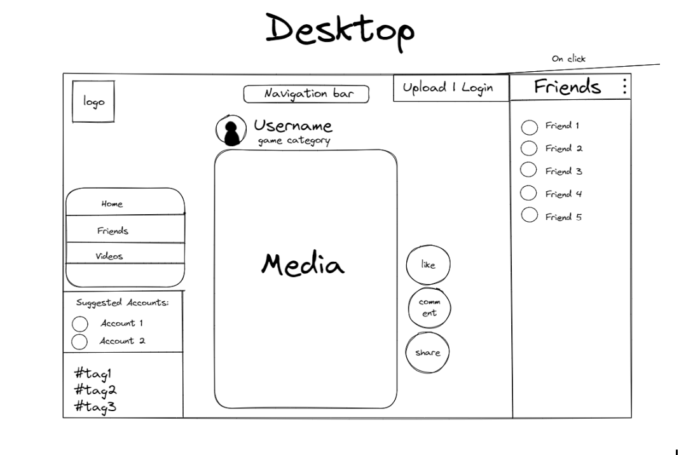
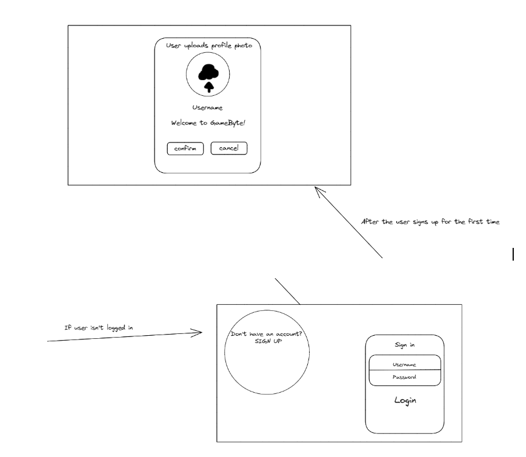
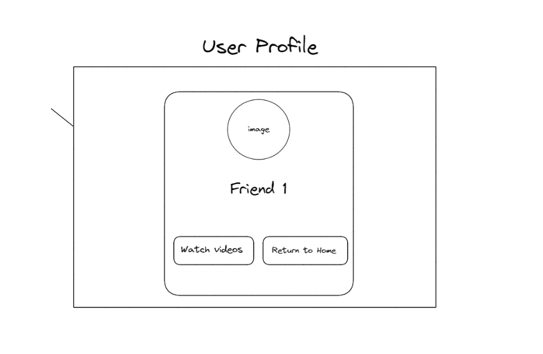
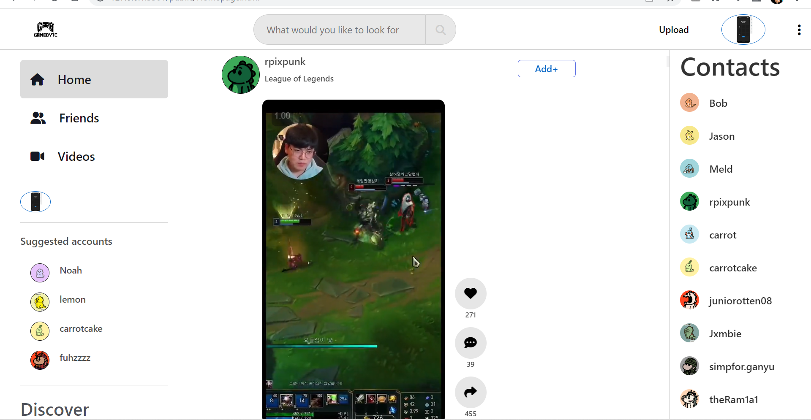
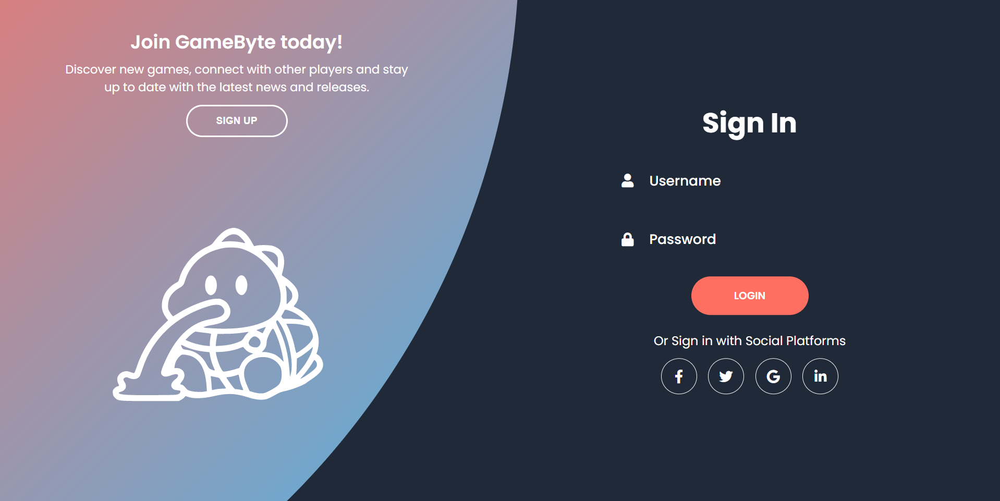
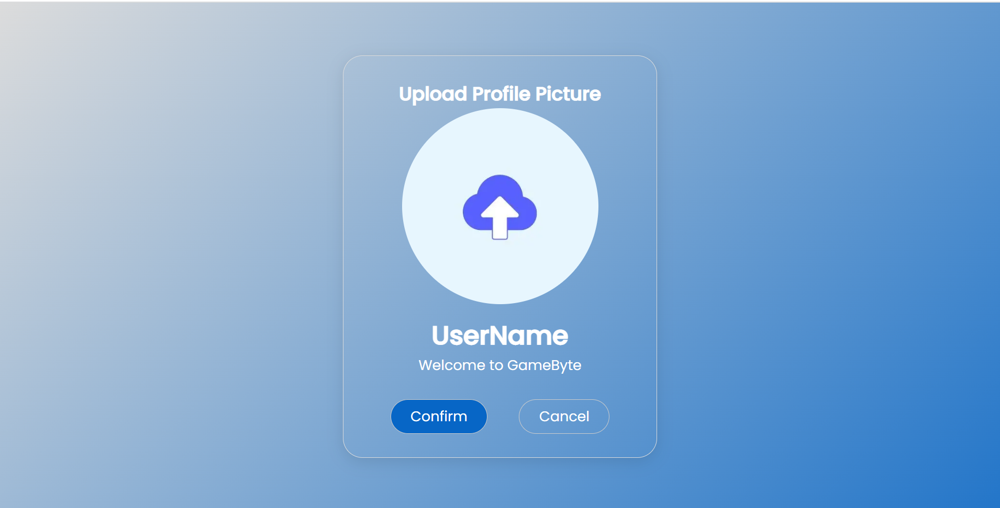
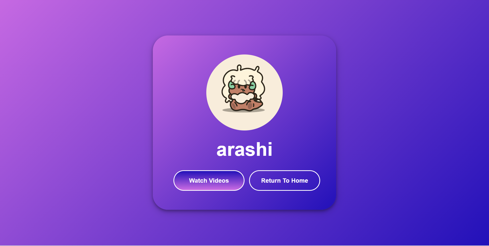

# INFO1601 Website

This is a straightforward website constructed using predominantly vanilla HTML, CSS, and JS as a project for my front-end development course at university. It has been kept intentionally minimalistic.

## Features
- Enjoy video viewing and uploading capabilities. 
- Communicate with friends through messaging functionality. 
- Efficiently search and sort content based on games and friends. 
- Access short-form gaming content for quick viewing. 
- Easily switch between a variety of visually appealing themes. 
- Seamlessly login or logout and upload an avatar. 

## Mobile Responsiveness
Due to time constraints during development and the absence of grading, the website's mobile scaling may not be optimal. If you desire a fully responsive website, please feel free to contact me at carrot#8856 on Discord.

## Recent Changes
I have recently made several modifications, including the removal of my API and addition of static files. These alterations were implemented to ensure that the website remains accessible to future students indefinitely.

## Website Availability
You can access the website at: https://carrot2803.github.io/website/public/Homepage.html

## Contributing

Contributions are welcome.! If you have any ideas, suggestions, or bug reports, please create an issue or submit a pull request. You can also contact me at carrot#8856 on Discord.

## Wireframe
Feel free to stop reading below are drafts/prototypes along with snippets  

Homepage Draft
 
Upload photo draft
 
User profile draft
 
Homepage
 
Login Page(Dark solar theme)
 
Upload photo
 
User profile

